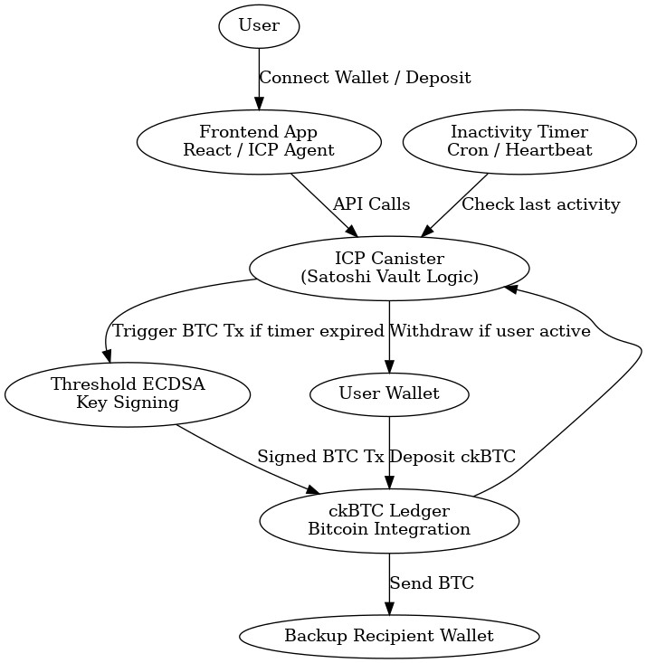

# 🪙 Satoshi Vault — The Bitcoin Dead Man Switch

## 💡 Overview
Satoshi Vault is a Bitcoin inheritance vault built on the **Internet Computer**.  
It uses **ckBTC** for native Bitcoin transfers and **Threshold ECDSA** for automated, secure transaction signing.  
If a user becomes inactive for a defined period, their funds are automatically transferred to a backup wallet — no intermediaries, no bridges, no wrapped BTC.

---

## 🚀 Features
- ✅ Secure deposit and withdrawal using ckBTC
- ✅ User inactivity timer with configurable timeout
- ✅ Automated BTC transfer via Threshold ECDSA
- ✅ Optional encrypted notes using vetKeys
- ✅ Principal-based authentication
- ✅ Stable memory persistence
- ✅ Comprehensive error handling
- ✅ Bitcoin address validation
- ✅ Manual withdrawal support

---

## 🧠 Architecture
See `architecture.png` or diagram below:


---

## ⚙️ Tech Stack
| Layer | Technology |
|-------|-------------|
| Backend | Rust ICP Canisters |
| Bitcoin Integration | ckBTC + Threshold ECDSA |
| Storage | ICP Stable Memory (ic-stable-structures) |
| Privacy Layer | vetKeys (Encrypted Notes) |
| Serialization | bincode + serde |

---

## 🧩 Setup Instructions

### Prerequisites
- Rust toolchain (latest stable)
- Internet Computer SDK (dfx)
- Node.js (for frontend, if applicable)

### Installation

1. **Clone the repository**
```bash
git clone <repository-url>
cd Bit-Canister
```

2. **Install dfx** (if not already installed)
```bash
sh -ci "$(curl -fsSL https://internetcomputer.org/install.sh)"
```

3. **Start local ICP network**
```bash
dfx start --background
```

4. **Deploy the canister**
```bash
dfx deploy satoshi_vault
```

### Development

1. **Build the canister**
```bash
dfx build satoshi_vault
```

2. **Run tests** (when implemented)
```bash
cargo test --target wasm32-unknown-unknown
```

---

## 📚 API Reference

### Create Vault
```rust
create_vault(backup_wallet: String, timeout_days: u64, encrypted_note: Option<String>) -> Result<u64>
```
Creates a new vault for the caller with specified backup wallet and timeout.

### Get Vault
```rust
get_vault() -> Result<Vault>
```
Retrieves the caller's vault information.

### Deposit ckBTC
```rust
deposit_ckbtc(amount: u64) -> Result<()>
```
Deposits ckBTC into the caller's vault.

### Withdraw ckBTC
```rust
withdraw_ckbtc(amount: u64, destination: Principal) -> Result<()>
```
Withdraws ckBTC from vault to a Principal destination.

### Withdraw to Bitcoin
```rust
withdraw_to_bitcoin(amount: u64, destination: String) -> Result<()>
```
Withdraws funds to a Bitcoin address using Threshold ECDSA.

### Check In
```rust
check_in() -> Result<()>
```
Resets the inactivity timer for the vault.

### Trigger Expired Transfers
```rust
trigger_expired_transfers() -> Result<Vec<u64>>
```
Processes all expired vaults and transfers funds to backup wallets.

### Update Vault
```rust
update_vault(backup_wallet: Option<String>, timeout_days: Option<u64>, encrypted_note: Option<String>) -> Result<()>
```
Updates vault settings.

### Store Encrypted Note
```rust
store_encrypted_note(encrypted_note: String) -> Result<()>
```
Stores an encrypted note in the vault using vetKeys.

### Get Encrypted Note
```rust
get_encrypted_note() -> Result<Option<String>>
```
Retrieves the encrypted note from the vault.

---

## 🔒 Security Features

- **Principal-based authentication**: All operations require caller authentication
- **Stable memory storage**: Data persists across canister upgrades
- **Threshold ECDSA**: Secure Bitcoin transaction signing
- **Input validation**: Bitcoin address and timeout validation
- **Error handling**: Comprehensive error types and messages

---

## 📝 Notes

- The ckBTC integration includes placeholder implementations that need to be completed with actual ledger calls
- Threshold ECDSA Bitcoin transfers require full transaction construction (UTXO management, fee calculation, etc.)
- vetKeys integration is simplified and may need full implementation depending on requirements

---

## 🔗 References

- [ICP Bitcoin Integration](https://docs.bitcoindefi.dev/)
- [ckBTC Documentation](https://docs.bitcoindefi.dev/ckbtc.html)
- [Threshold ECDSA](https://docs.bitcoindefi.dev/sign-in-bitcoin.html)
- [ICP Examples](https://github.com/dfinity/examples/rust/basic-bitcoin)
